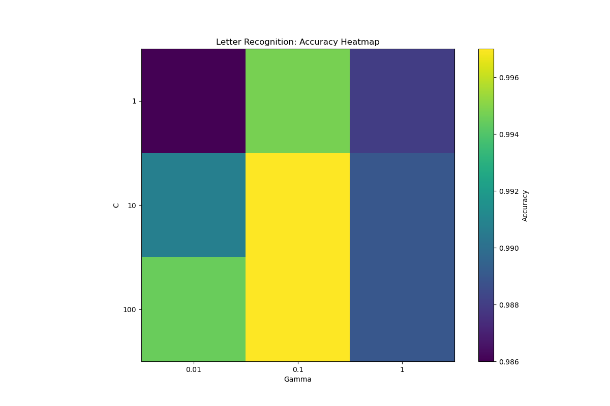
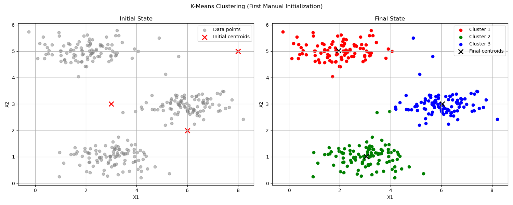
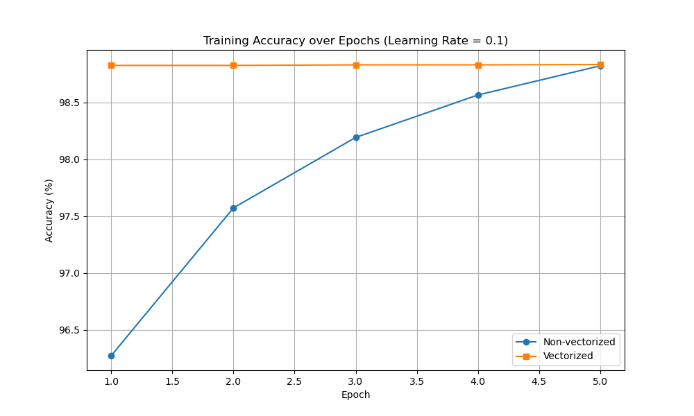

# AI & Machine Learning Coursework

This repository brings together assignments from my undergraduate Artificial Intelligence and Machine Learning courses.

The coursework moves from classical search and game-playing algorithms to regression, neural networks, support vector machines, and clustering. Across the assignments, I worked with the algorithms both at the implementation level and through experiments on parameters, optimization behavior, and model performance.

## What I worked on

| Area | Topics |
| --- | --- |
| Search | BFS, depth-limited DFS, A*, Manhattan distance |
| Game AI | Negamax, alpha-beta pruning, heuristic evaluation |
| Regression | Linear and logistic regression, gradient descent, learning-rate comparisons |
| Neural networks | Forward and backpropagation, SGD, vectorized training, LeNet |
| SVM | SMO, linear and RBF kernels, C/gamma experiments |
| Clustering | K-means, DBSCAN, elbow method |
| Decision trees | Entropy, information gain, scikit-learn experiments |

## Selected coursework

### 8-Puzzle Search

The [8-puzzle solver](Intro-to-AI/8-puzzle%20solver/eight_puzzle.py) compares breadth-first search, depth-limited depth-first search, and A* with Manhattan distance through a small Tkinter interface.

### SVM and SMO

The [SVM assignment](Machine-Learning/assignment3-SVM/svm.py) includes an SMO training loop with alpha-pair and bias updates, linear and RBF kernels, and experiments across several C and gamma settings.

### Neural Networks

The [two-layer network exercise](Machine-Learning/assignment2-digit-recognition/two_layer_nn.py) implements forward propagation, backpropagation, sample-wise SGD, and a vectorized training path for MNIST. A separate [LeNet exercise](Machine-Learning/assignment2-digit-recognition/lenet.py) explores convolutional networks with PyTorch.

### Clustering

The clustering assignments cover [K-means](Machine-Learning/assignment4-clustering/kmeans.py) centroid updates and [DBSCAN](Machine-Learning/assignment4-clustering/dbscan.py) neighborhood search and cluster expansion, with experiments on parameter choices and the elbow method.

### Gobang

The [Gobang project](Intro-to-AI/gobang_AI/gobang_yiannischen.py) combines Negamax, alpha-beta pruning, pattern-based evaluation, and nearby-move ordering in a playable interface.

## Some results

| SVM parameter comparison | K-means from initial to final centroids | Two-layer network training |
| --- | --- | --- |
|  |  |  |

## Repository structure

```text
.
├── Intro-to-AI/
│   ├── 8-puzzle solver/
│   ├── decision_tree/
│   ├── gobang_AI/
│   └── NN_digit_recognition/
└── Machine-Learning/
    ├── assignment1-regression/
    ├── assignment2-digit-recognition/
    ├── assignment3-SVM/
    └── assignment4-clustering/
```

## Running the code

Dependencies vary because the assignments came from different courses and semesters. Use a separate virtual environment for each assignment.

### 8-puzzle

```bash
python3 -m venv .venv && source .venv/bin/activate
python3 -m pip install pillow
python3 "Intro-to-AI/8-puzzle solver/eight_puzzle.py"
```

### SVM

```bash
cd Machine-Learning/assignment3-SVM
python3 -m venv .venv && source .venv/bin/activate
python3 -m pip install -r requirements.txt
unzip -j data/Archive.zip -d data
python3 svm.py linear
```

## Notes

Some assignments use instructor-provided starter code, course materials, or reference implementations. The repository preserves them in the form I used while completing the coursework and experiments.

- `Intro-to-AI/gobang_AI/graphics.py` is John Zelle's Simple Object Oriented Graphics Library, version 5.0, distributed under the GPL as noted in its source header.
- `Intro-to-AI/NN_digit_recognition/mnist_NN.py` follows course/reference material.
- The decision-tree exercise uses scikit-learn, while the LeNet exercise uses PyTorch and torchvision.
- Datasets are course or public datasets and are not part of this repository's original work.
